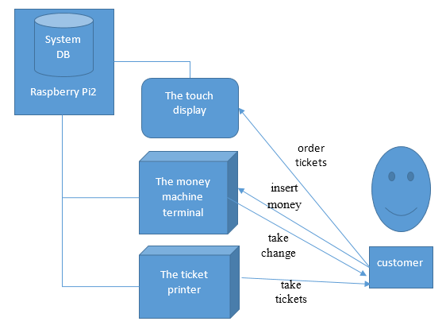
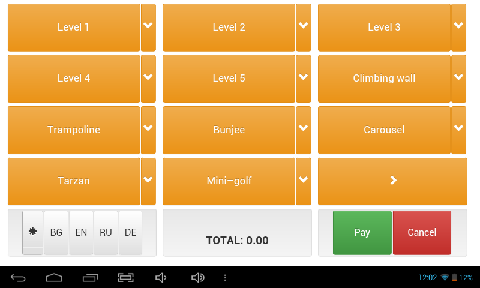
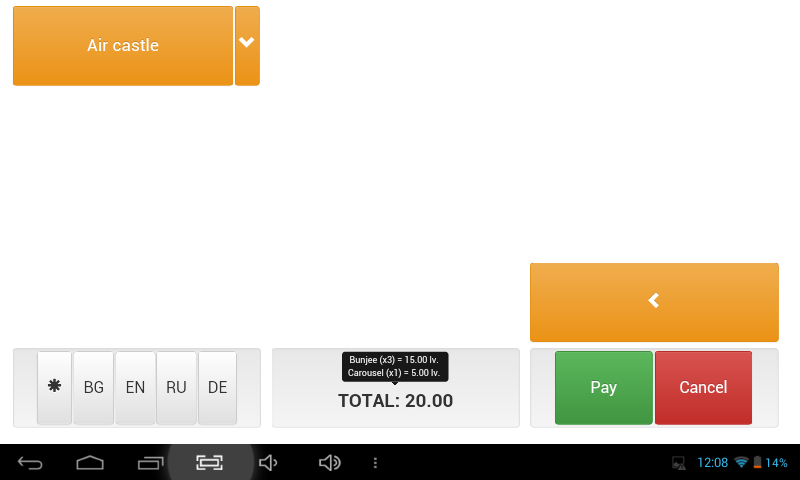

# KOKOLANDIA KIOSK

## What is Kokolandia ?

Kokolandia is an amusement park for children with different <u>attractions</u> like:
- Air castle
- Walking rope
- Trampoline
- Other...
Kokolandia website: [http://kokolandia.com/](http://kokolandia.com/)

## What is the kiosk?

The kiosk will be automated ticket machine for selling tickets. The main system will run on Raspberry Pi2, which will be
interacting with an touch-display interface, on which people will order tickets for the different <u>attractions</u>.
A money-take hardware will be attached to the system. The money hardware will return change.
	

## The display module for kiosk

This project is serving for the touch-display module of the **kiosk**. We've found tablets from China, 
which are cheaper than the touch-displays, so currently we are using a tablet for the display. This gives us the
opportunity to make the display interface to be rendered in browser and shown in full-screen mode or as an android
application.

  

Run kiosk live demo [here](http://www.viki3d.com/demos/kiosk)